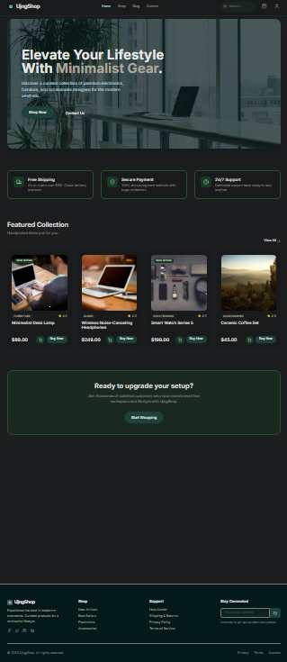

# 🛍️ ujngshop — Simple Web3 Store dApp

A clean and minimal Web3 mini dApp built using **Next.js**, **TailwindCSS**, and **Ethers.js**.  
Designed as a portfolio-ready project to demonstrate wallet connection and a modern Web3 UI.

---

## 🚀 Features

- 🔌 Connect Wallet (MetaMask / WalletConnect)
- ⚡ Built with Next.js App Router
- 🎨 TailwindCSS modern UI
- 📦 Clean component-based structure
- 🌐 Ready for Web3 expansion (NFT, tokens, payments)

---

## 📸 Screenshots

<p align="center">
  
</p>

---

## 📂 Project Structure

```
ujngshop/
│── app/
│── components/
│── public/
│── styles/
│── package.json
│── README.md
```

---

## 🛠️ Installation

```bash
npm install
npm run dev
```

Go to:  
http://localhost:3000

---

## 👤 Author

**ujngflsh**

If you like this project, give it a ⭐!
